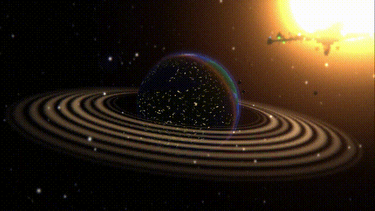

# Aaru's 3D Portfolio — Interactive Space Experience

An immersive, scroll-driven 3D space portfolio built with Three.js. Click on the Earth to view my resume and skills, or click the Space Station to explore my projects and contact info.

**All models and code are created by me.**

---

## Preview



> *Scroll through Earth orbit, past the space station, and click objects to explore my portfolio.*

## Features

- **Interactive 3D Scene** — Click Earth for resume, click Station for projects & contact
- **Glassmorphism UI Panels** — Sleek overlay panels with blur effects
- **Procedural Planet** — Earth-like world with terrain, clouds, atmosphere, and city lights
- **Space Station** — Detailed modular station with solar panels, lights, and docking ports
- **Spaceship** — Animated ship with glowing engines and exhaust trails
- **Animated Sun** — Procedural shader sun with solar flares and corona
- **Scroll-Driven Camera** — Smooth keyframe path with wheel and touch input
- **Post-Processing Pipeline** — Bloom, film grain, chromatic aberration, vignette, and motion blur
- **Hover Feedback** — Cursor changes to pointer when hovering clickable objects

---

## Installation

1. **Clone the repository**

   ```bash
   git clone https://github.com/aarravhacker/cosmic-voyage.git
   cd cosmic-voyage
   ```

2. **Install dependencies**

   ```bash
   npm install
   ```

3. **Start the development server**

   ```bash
   npm run dev
   ```

4. Open your browser at the URL shown in the terminal (usually `http://localhost:5173`)

---

## Usage

- **Scroll** (mouse wheel) or **swipe** (touch) to navigate through the scene
- **Click Earth** to open my resume panel (skills, interests, goals, hardware)
- **Click Space Station** to open projects & contact panel
- **Close panels** by clicking X, clicking the backdrop, or pressing Escape
- The scene loops automatically after orbiting the station

---

## Tech Stack

| Technology | Purpose |
|---|---|
| **Three.js** | 3D rendering engine |
| **Vite** | Build tool and dev server |
| **GLSL Shaders** | Custom planet terrain, clouds, atmosphere, sun surface, exhaust trails, and post-processing |
| **JavaScript (ES Modules)** | Modular codebase |

---

## License

This project is personal work. All 3D models, shaders, and code are original creations.
